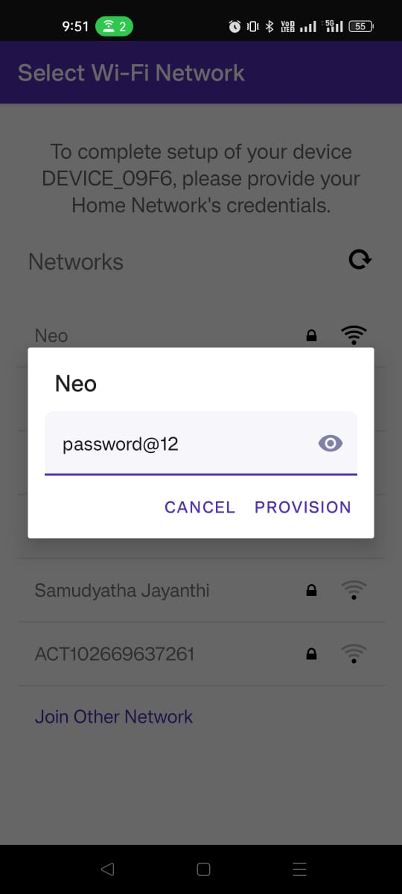

# ESP32 BLE Wi-Fi Provisioning

## Overview
This project demonstrates ESP32 Wi-Fi provisioning using Bluetooth Low Energy (BLE) with the ESP-IDF framework. The provisioning allows users to configure Wi-Fi credentials via a smartphone app.


## Features
- Uses BLE for Wi-Fi provisioning.
- Generates a QR code for easy device setup.
- Displays Serial Monitor logs for debugging.
- Implemented using ESP-IDF.

## Prerequisites
- **Hardware:** ESP32 WROOM 32.
- **Software:**
  - ESP-IDF installed and configured ([Installation Guide](https://docs.espressif.com/projects/esp-idf/en/latest/esp32/get-started/))
  - ESP BLE Provisioning App ([Android](https://play.google.com/store/apps/details?id=com.espressif.provble))
  - Serial Monitor for debugging

## Setup and Compilation
1. Clone the repository:
   ```sh
   git clone https://github.com/your-repo/esp32-ble-provisioning.git
   cd esp32-ble-provisioning
   ```
2. Configure the ESP-IDF environment:
   ```sh
   . $HOME/esp/esp-idf/export.sh
   ```
3. Compile and flash the code:
   ```sh
   idf.py build
   idf.py flash
   ```
4. Monitor serial logs:
   ```sh
   idf.py monitor
   ```

## Provisioning Process
1. **Start the ESP32**: It will initialize BLE and generate a QR code.
2. **Scan the QR code** using the [ESP BLE Provisioning App](https://play.google.com/store/apps/details?id=com.espressif.provble).
3. **Enter Wi-Fi credentials** in the app.
4. **ESP32 connects to Wi-Fi** and logs the IP address.

## Serial Monitor Logs
Below are sample logs during provisioning:
```
Wi-Fi Credentials received:
    SSID: MyNetwork
    Password: MyPassword
Wi-Fi connected successfully
```

## Screenshots
### BLE App Screenshots
<p align="center">
  
  
  
</p>

### ESP-IDF IDE Screenshot


### Serial Monitor Logs
 

## Demo Video
[Watch the Demo](https://github.com/user-attachments/assets/fc5e7426-9a40-47e9-bb46-c8cebd9b76ec)

## References
https://github.com/espressif/esp-idf/tree/master/examples/provisioning
https://play.google.com/store/apps/details?id=com.espressif.provble
https://github.com/nayuki/QR-Code-generator
https://github.com/espressif/idf-extra-components/tree/master
https://docs.espressif.com/projects/esp-idf/en/latest/esp32/get-started/


